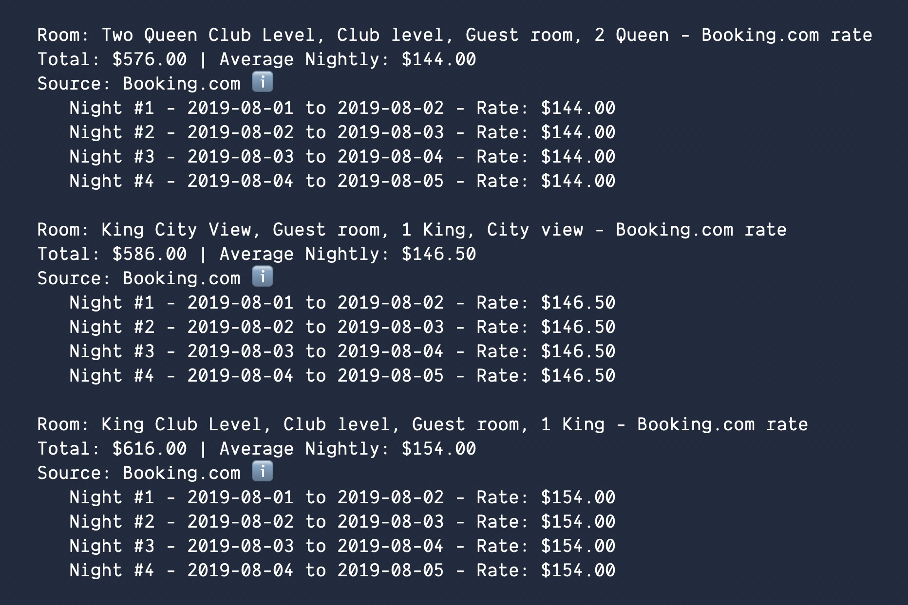

# Getting Hotel Details
## Introducing this Code Sample

We offer an API called [Get Hotel Details](https://beta.developer.sabre.com/docs/rest_apis/hotel/search/get_hotel_details_v1) to help you find information about a specific property that meets your travelers' needs. Through using the API, in one request, your application receives:

  * Room rates and availability supplied from multiple aggregator sources offering millions of property options
  * Property information including where it is, how to contact, and display-ready image links
  * Corporate discounts, loyalty identification, and international currency types

The goal is empowering you to build solutions that will help your travelers find dream offers.

What does the sample app look like when it runs? Here is a screen shot:



## Read the Article

There is [an article](https://blog.developer.sabre.com/) serving as a partner to this sample app source code. You’ll find explanations and additional resources written in it to add context whenever possible. 

## Setting-up the Sample App

There are a few one-time only steps for installing pre-requisites listed below.

## Installing NodeJS

The sample app is written in **NodeJS**. You’ll need to have its run-time installed on your local development computer. If you’ve never installed NodeJS please refer to the [Node Foundation](https://nodejs.org/en/download/) to find an installer most appropriate for your O/S.
 
## Cloning with Git

Take a copy of the source code from our [repo stored on GitHub](https://github.com/SabreDevStudio). When you browse the availability sample app repo you’ll find the green button labeled "clone". Clicking it reveals the URL you’ll use to `git clone`, which is how source code is first copied down from the server to your computer. 

## Getting Sabre API Credentials

You’ll need your [Sabre REST APIs CERT-environment credentials](https://developer.sabre.com/guides/travel-agency/quickstart). They’re used by the sample app as part of the authentication flow to call Get Hotel Details.

## Installing Project Dependencies

Once you’ve installed NodeJS, and pulled down a copy of the source code, you’ll need to install the app’s open-source dependencies. That’s accomplished by running this command in the local copy of the source code:

`npm install`

The [npm](https://www.npmjs.com/) (Node Package Manager) tool will pull down copies of all open-source code this app refers to. File transfers might take a few minutes.

## Encoding Credentials

Using the APIs requires entering credentials so that the app can find them. Part of its logic is requesting a token in order to properly call the Get Hotel Details API. Tokens are gained in part from private credentials.

Simply open up the app’s source code and look at the file named [`config.js`](./app/config.js) to find where they’re declared. There are two attributes (`userSecret` and `appId`) where values can be copied-in as hardcoded strings. Alternatively, they can be picked-up from O/S environment variables that you create on your local development machine.

```
exports.api = {
  apiEndPoint: 'https://api-crt.cert.havail.sabre.com',
  userSecret: process.env.SWS_API_SECRET || '',
  appId: process.env.SWS_APP_ID || '',
};
```

Environment variables are preferred in this sample app because it keeps them hidden and protected. In this case all code is publicly visible in revision control, and that’s not the place for private information.

* `appId` – is your application identifier and [read more about setup](https://developer.sabre.com/guides/travel-agency/content-services-for-lodging)
* `userSecret` – is a base64-encoded string computed from steps you can [read more about](https://developer.sabre.com/guides/travel-agency/how-to/rest-apis-token-credentials)

## Running the Sample App

The sample app is ready to run after setup. Enter this command in the local copy of the source code to run the sample app:

`npm start` 

When this works normally the app renders a list of lodging options showing property information and detailed rates from the content sources. What you will see should look very similar to the image found above. Results match a hotel code for a particular date and time.

## Updating the Search Criteria Config File

Changing hotel search criteria is easy. Simply open up the app’s source code and look at the file named [`searchCriteria.js`](./app/searchCriteria.js) to find the hotel code and dates to get details. Update any of the attributes with valid values and restart the app to see the search results. 

```
const SearchCriteria = {
  hotelCode: '100060578',
  date: {
    checkIn: '2019-08-01',
    checkOut: '2019-08-05',
  },
};
```

Occasionally, availability results are not found. In that case adjust the `checkIn` and `checkOut` parameters to move them a little farther into the future. Certain properties simply do not have availability some days.

## Next Steps

Make use of this sample app as a testing tool. It’s a simple, flexible, jumping-off point for learning how to use Sabre APIs in general, and Get Hotel Details in particular. Look up the [docs](https://developer.sabre.com/docs/rest_apis/hotel/search/get_hotel_details_v1) and discover all that it can do. Find something interesting? Call it by changing the request attribute values found in the file [`hotelDetailsModel.js`](./app/hotelDetailsModel.js). Save the file and run the app to see how the updates perform.

Get in touch with us. GitHub allows communication through its repo-level issue and pull request channels. Use the built-in [issues section](https://github.com/SabreDevStudio/get-hotel-details-sample-nodejs/issues).

We also have an [active community on Stack Overflow](https://stackoverflow.com/questions/tagged/sabre).

## License

Copyright (c) 2019 Sabre Corp Licensed under the MIT license.

## Disclaimer of Warranty and Limitation of Liability

This software and any compiled programs created using this software are furnished “as is” without warranty of any kind, including but not limited to the implied warranties of merchantability and fitness for a particular purpose. No oral or written information or advice given by Sabre, its agents or employees shall create a warranty or in any way increase the scope of this warranty, and you may not rely on any such information or advice.
Sabre does not warrant, guarantee, or make any representations regarding the use, or the results of the use, of this software, compiled programs created using this software, or written materials in terms of correctness, accuracy, reliability, currentness, or otherwise. The entire risk as to the results and performance of this software and any compiled applications created using this software is assumed by you. Neither Sabre nor anyone else who has been involved in the creation, production or delivery of this software shall be liable for any direct, indirect, consequential, or incidental damages (including damages for loss of business profits, business interruption, loss of business information, and the like) arising out of the use of or inability to use such product even if Sabre has been advised of the possibility of such damages.
